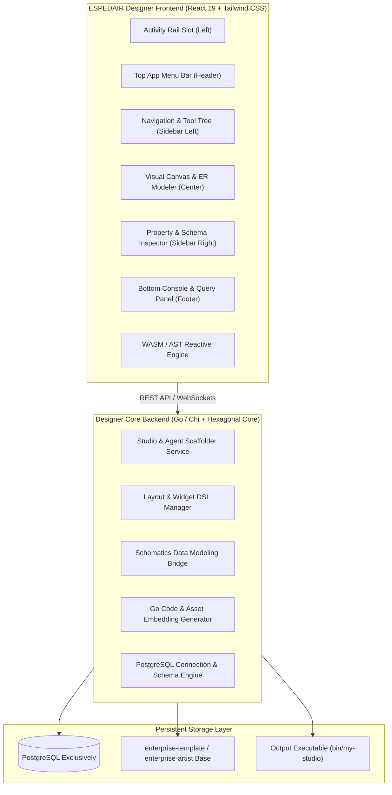

# ESPEDAIR Designer — Visual Studio & Agent Application Builder Architecture

> **Subsystem**: ESPEDAIR Designer (`designer` / `ea-designer`)  
> **Base Template**: `/home/jonk/workspace/ESPEDAIR/studio/enterprise-template` & `enterprise-artist`  
> **Data Modeling Engine**: ESPEDAIR Schematics (`schematics`)  
> **Inspiration**: Appsmith & ToolJet Low-Code Architectures (`INSPIRE/LOWCODE`)  
> **Deployment Target**: Self-Contained Single Go Binary with React 19 Frontend Embedding + PostgreSQL  
> **Status**: Architecture Specification & Design  

---

## 1. Executive Vision & System Purpose

**ESPEDAIR Designer** is an extensible visual low-code studio and application builder that allows enterprise architects and developers to design, customize, and generate production-ready **Studio (SPA)** or **Autonomous Agent** applications.

### Key Capabilities
1. **Standard Shell Layout with Dynamic Slot Architecture**:
   - **Activity Rail (Left-most)**: Customizable icon navigation for perspective switching.
   - **Top Menu / Header Bar**: Global actions, breadcrumbs, search, environment switchers, and user profiles.
   - **Collapsible Primary & Secondary Sidebars**: Tree views, object navigators, property inspectors, and toolboxes.
   - **Visual Multi-Mode Canvas**: Visual Drag-and-Drop Form/App Canvas, Entity-Relationship (ER) Modeler, Lineage DAG Viewer, and Code/SQL Editor.
   - **Bottom Tray / Terminal Panel**: Output logs, query runners, test results, and audit streams.
2. **Enterprise Template Scaffolding (`enterprise-template` & `enterprise-artist`)**:
   - Creates new studios or agents based on the proven hexagonal Go backend + React 19 / Tailwind CSS embedded frontend architecture.
3. **Deep Data Modeling & Schematics Integration**:
   - Integrates native SQL schema modeling, column-level lineage, multi-dialect DDL generation, and declarative migrations from **ESPEDAIR Schematics**.
4. **Single Statically-Linked Binary Output**:
   - Compiles down to a single standalone Go executable with embedded React assets (`//go:embed all:dist`) backed exclusively by PostgreSQL.

---

## 2. System Architecture & Component Diagram



---

## 3. Dynamic Slot & Layout Engine Specification

```
+----------------------------------------------------------------------------------------------------+
| [Top Menu Bar]  Logo | File  Edit  View  Tools  Env: [PROD v] | [Schematics Sync] [Deploy] [User] |
+---+----------------------+--------------------------------------------------+----------------------+
| R | [Sidebar: Left]      | [Main Canvas Area]                               | [Sidebar: Right]     |
| A |                      |                                                  |                      |
| I | • Data Models (12)   |  +--------------------------------------------+  | • Properties         |
| L | • ER Diagrams        |  |  [Visual App Canvas / ER Diagram / DAG]    |  | • Data Bindings      |
|   | • Query Builders     |  |                                            |  | • SQL AST Inspector  |
| [1| • Agent Workflows    |  |  [Table: fct_orders] ──> [dim_customers]   |  | • Validation Rules   |
| 2 | • Custom Widgets     |  |                                            |  | • Event Handlers     |
| 3 |                      |  +--------------------------------------------+  |                      |
| 4 |                      |                                                  |                      |
| 5]|                      +--------------------------------------------------+                      |
|   |                      | [Bottom Console] Logs | Query Runner | Terminal  |                      |
+---+----------------------+--------------------------------------------------+----------------------+
```

### 3.1. Slot Configuration Model (`schema/layout_dsl.json`)
```json
{
  "layout_version": "1.0.0",
  "app_name": "custom_analytics_studio",
  "theme": "dark_modern",
  "slots": {
    "rail": {
      "items": [
        { "id": "explorer", "icon": "FolderIcon", "label": "Model Explorer", "target_sidebar": "model_tree" },
        { "id": "designer", "icon": "LayoutIcon", "label": "Visual Canvas", "target_canvas": "app_builder" },
        { "id": "schematics", "icon": "DatabaseIcon", "label": "Data Architect", "target_canvas": "er_diagram" },
        { "id": "agent", "icon": "BotIcon", "label": "Agent Workflows", "target_canvas": "workflow_graph" }
      ]
    },
    "menu_bar": {
      "menus": ["File", "Edit", "Schema", "Deploy", "Help"],
      "actions": ["SyncWithGit", "GenerateBinary", "RunMigration"]
    },
    "sidebar_left": {
      "default_panel": "model_tree",
      "panels": ["model_tree", "widget_toolbox", "datasource_tree", "git_status"]
    },
    "sidebar_right": {
      "default_panel": "properties_inspector",
      "panels": ["properties_inspector", "lineage_impact", "security_rbac"]
    },
    "canvas": {
      "mode": "visual_editor",
      "supported_modes": ["visual_editor", "er_diagram", "lineage_dag", "sql_editor", "form_designer"]
    },
    "bottom_tray": {
      "panels": ["sql_console", "audit_log", "test_runner", "terminal"]
    }
  }
}
```

---

## 4. Multi-Phase Implementation Roadmap

| Phase | Subsystem | Focus Area & Deliverables |
| :--- | :--- | :--- |
| **Phase 1** | **Foundation & Scaffolder** | Base project initialization from `enterprise-template`, Go/Chi backend, PostgreSQL schema migrations for designer metadata. |
| **Phase 2** | **Shell Layout & Slot Engine** | React 19 shell layout with dynamic Activity Rail, Menu Bar, Left/Right Sidebars, Center Canvas, and Bottom Console. |
| **Phase 3** | **Visual Canvas & Tool Registry** | Drag-and-drop canvas grid engine, pre-built component toolbox (tables, charts, forms, buttons), property inspectors. |
| **Phase 4** | **Data Modeling & Schematics Integration** | Visual ER modeler, AST SQL editor, column-level lineage graph viewer, live declarative schema diffing. |
| **Phase 5** | **Code Generation & Binary Embedding** | Automated Go template compiler, React bundle builder, `//go:embed all:dist` packaging into single release executables. |
