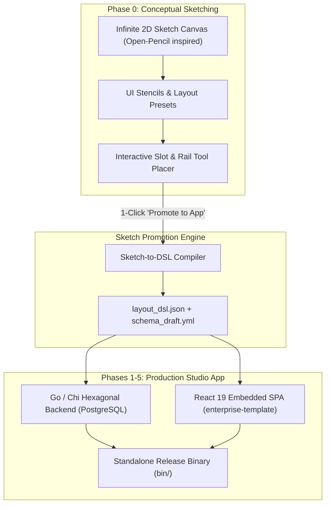

# Phase 0 Implementation Plan: Conceptual Sketch & Wireframe Designer ("Sketch-to-App")

> **Subsystem**: ESPEDAIR Designer (`designer` / `ea-designer`)  
> **Phase**: 0 of 5 (Conceptualization & Rapid Wireframing Entry Point)  
> **Goal**: Provide a lightweight, freeform sketch and low-fidelity wireframing canvas (inspired by Open-Pencil & Penpot) that allows architects and developers to conceptualize studio layouts, tool placements, agent workflows, and data models before committing to code.  

---

## 1. Objectives & Deliverables

1. **Freeform Conceptual Sketch Canvas (`web/src/sketch/`)**:
   - Infinite 2D zoom/pan canvas for rapid brainstorming, wireframing, and component layout exploration.
   - Low-fidelity wireframing stencil palette: Wireframe Boxes, Navigation Bars, Metric Cards, Table Placeholders, Form Fields, Arrow Connectors, Sticky Notes, and Annotations.
2. **Standard Shell Layout Wireframe Templates**:
   - Pre-configured wireframe presets matching the standard 5-slot architecture:
     - Preset 1: *Analytics Studio Layout* (Activity Rail + Model Tree + Dashboard Canvas + SQL Console).
     - Preset 2: *Autonomous Agent Studio* (Workflow Graph + Prompt Inspector + Terminal Log Stream).
     - Preset 3: *Data Architecture Studio* (ER Diagram Modeler + Lineage DAG + Schema Diff).
3. **Interactive Slot Placement & Tool Mapping**:
   - Visual tool placers to drag-and-drop tool icons onto the **Activity Rail**, menu items onto the **Top Menu Bar**, drawers into **Sidebars**, and tool tabs into the **Bottom Console**.
4. **"Promote Sketch to Living App" Compiler (`web/src/sketch/promoter.ts`)**:
   - One-click transformation of conceptual sketch boxes and stencils into a structured layout DSL (`layout_dsl.json`).
   - Automatically scaffolds the initial Go backend models and React 19 component tree in `Phase 1`.
5. **AI Agent Sketch-to-App Assistance**:
   - Allows users to sketch a rough UI concept or ER relationship and prompt the agent to auto-generate the complete data schema, SQL queries, and widget bindings.

---

## 2. Component Architecture & Workflow



---

## 3. Step-by-Step Task Checklist

- [ ] **Task 0.1**: Implement infinite 2D canvas viewport with zoom, pan, and grid snapping in `web/src/sketch/SketchCanvas.tsx`.
- [ ] **Task 0.2**: Create low-fidelity wireframing stencils (Containers, Navigation Rails, Data Tables, Charts, Form Inputs, Connectors).
- [ ] **Task 0.3**: Build interactive Shell Slot Placer allowing visual assignment of tools to Rail, Header, Sidebars, Canvas, and Footer.
- [ ] **Task 0.4**: Implement Shell Wireframe Templates (Analytics Studio, Agent Studio, Data Modeling Studio).
- [ ] **Task 0.5**: Build `SketchPromoter` compiler converting visual wireframe shapes into `layout_dsl.json` and Schematics schema drafts.
- [ ] **Task 0.6**: Implement JSON export and import for sharing conceptual sketches across teams.

---

## 4. Verification Plan

```bash
# 1. Launch Sketch Designer Mode
cd web && npm run dev -- --mode sketch

# 2. Verify Conceptualization Workflow:
# - Open Sketch Canvas, drag 'Analytics Studio' wireframe preset onto canvas.
# - Customize Activity Rail tools and add a new Table widget to the canvas.
# - Click 'Promote to Studio App' and verify that layout_dsl.json is cleanly generated.
```
