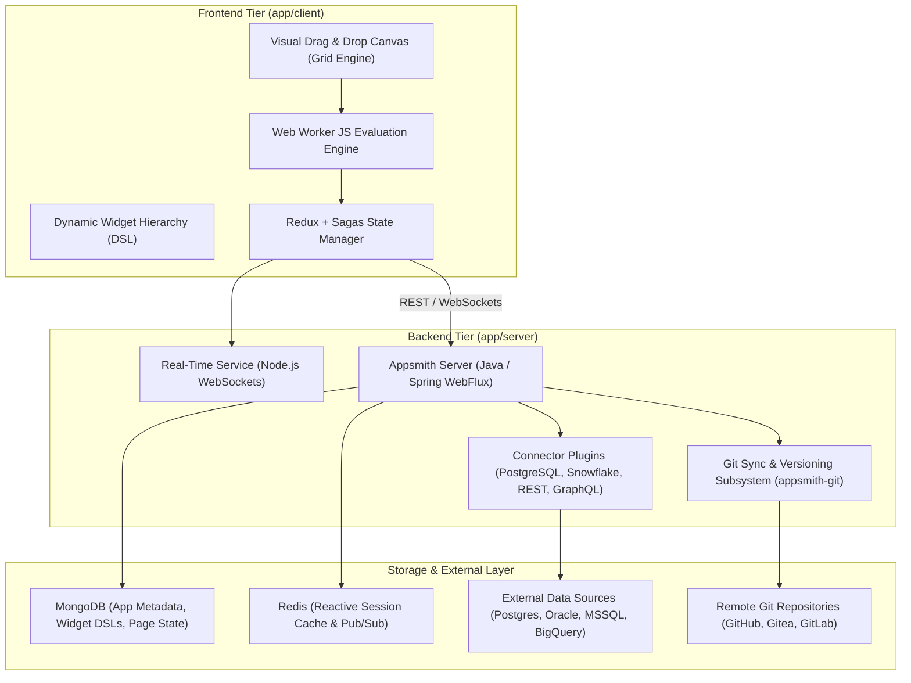

# Architectural Review: Appsmith

> **Target System**: Appsmith Open-Source Low-Code Platform  
> **Source Location**: `/home/jonk/workspace/INSPIRE/LOWCODE/appsmith`  
> **Review Context**: ESPEDAIR Designer (`designer`) Architectural Evaluation  
> **Date**: 2026-08-27  

---

## 1. Executive Summary

**Appsmith** is an enterprise-grade, open-source low-code application platform designed to rapidly construct internal tools, database admin panels, workflows, and CRUD portals. It features a reactive, microservices-oriented backend built on **Java / Spring Boot (Project Reactor)** and MongoDB, paired with a sophisticated **React 18 / TypeScript / Redux-Saga** client.

---

## 2. Core Architecture Breakdown

---

## 3. Key Architectural Strengths

### 3.1. High-Performance Client-Side JavaScript Evaluation Engine
- **Web Worker Sandbox**: Appsmith executes user-defined JavaScript expressions (e.g. `{{ Table1.selectedRow.id }}`) in a dedicated, isolated Web Worker thread to prevent UI freezing during complex transformations.
- **Dependency Directed Acyclic Graph (DAG)**: Computes reactive dependencies between widgets, queries, and JS objects (using AST parsing via Babel) so only directly impacted components re-evaluate when a data source changes.

### 3.2. Native Git Integration & Declarative Application Serialization (`appsmith-git`)
- **Page & DSL Serialization**: Entire applications (pages, widget hierarchies, actions, datasource references) are serialized into clean, declarative JSON files inside the Git tree (`/pages/*.json`, `/datasources/*.json`).
- **Branching & Merge Conflicts**: Supports multi-developer branching, pull requests, commit creation, and merge resolution directly within the visual interface.

### 3.3. Plugin-Based Polyglot Connector Architecture (`appsmith-plugins`)
- **Independent Plugin Modules**: Connectors for PostgreSQL, MySQL, Snowflake, Oracle, MSSQL, Redis, Elasticsearch, S3, and REST APIs are isolated Maven submodules.
- **Smart Query Substitution**: Implements AST-level parameterized query sanitization to prevent SQL injection while allowing dynamic low-code mustache bindings.

---

## 4. Key Limitations & Design Trade-offs

1. **Heavyweight Java / Spring WebFlux Footprint**:
   - High memory baseline (typically requires $\ge 2-4 \text{ GB}$ RAM at idle).
   - High startup latency compared to compiled Go or Rust backends.
2. **MongoDB Metadata Coupling**:
   - Core application metadata, role permissions, and tenant states are tightly coupled to MongoDB, complicating deployments in pure PostgreSQL/relational enterprise environments.
3. **Complex Frontend Redux-Saga Boilerplate**:
   - Heavy state management overhead in `app/client/` with legacy Redux patterns making custom widget extensions verbose.

---

## 5. Strategic Takeaways for ESPEDAIR Designer

| Capability | Appsmith Mechanism | ESPEDAIR Designer Opportunity |
| :--- | :--- | :--- |
| **Reactive Evaluation** | Web Worker + Babel AST Dependency Graph | Implement reactive dataflow in Rust / WASM for sub-millisecond AST reactivity. |
| **Git Synchronization** | Multi-file JSON serialization per page | Align with Schematics declarative YAML/JSON format for unified repo sync. |
| **Data Connectors** | Modular Java Spring plugins | Leverage Schematics database driver ports (`DatabaseDriver`) for native Rust DB pooling. |
| **Custom Widgets** | Iframe sandboxing | Use React 19 web component slots or zero-latency native component tree. |
