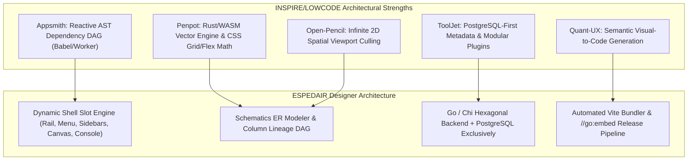

# Low-Code & Visual Design Frameworks: Comprehensive Comparative Analysis

> **Evaluated Platforms (5)**: **Appsmith**, **ToolJet**, **Penpot**, **Quant-UX**, **Open-Pencil**  
> **Target Subsystem**: ESPEDAIR Designer (`designer` / `ea-designer`) & Visual Studio Builder  
> **Source Directory**: `/home/jonk/workspace/INSPIRE/LOWCODE/`  
> **Date**: 2026-08-27  

---

## 1. Five-Way Executive Comparison Matrix

| Architectural Dimension | **Appsmith** | **ToolJet** | **Penpot** | **Quant-UX** | **Open-Pencil** | **ESPEDAIR Designer (Target)** |
| :--- | :--- | :--- | :--- | :--- | :--- | :--- |
| **Primary Domain** | Internal Tools / CRUD | Internal Business Apps | Vector Design & Prototyping | UX Prototyping & Analytics | UI Wireframing & Stencils | **Full Visual Studio & Agent Builder** |
| **Backend Stack** | Java 17 / Spring WebFlux | Node.js / NestJS (TS) | Clojure / JVM Server | Node.js / Express | None (Client/Desktop) | **Go / Chi (Hexagonal Architecture)** |
| **Metadata Database** | MongoDB + Redis | **PostgreSQL (TypeORM)** | **PostgreSQL + Redis** | MongoDB | Local JSON / File | **PostgreSQL Exclusively** |
| **Frontend Framework** | React 18, Redux-Saga | React, React-Query, Tailwind | ClojureScript / Reagent | Vue.js | React / TypeScript (Bun) | **React 19, Tailwind CSS, Lucide** |
| **Canvas Engine** | 24-Column Grid Canvas | Resizable Grid Canvas | **Rust WASM Vector Canvas** | Freeform Screen Canvas | **Infinite 2D Spatial Canvas** | **Dynamic Multi-Mode Canvas + WASM** |
| **Data Modeling / SQL** | Query Manager (No ER) | ToolJet DB (PostgREST) | None (Design Only) | None | None | **Native ER Modeler + Schematics AST** |
| **Code Generation** | None (Interpreter) | None (Interpreter) | None (CSS Export) | Vue / React Generator | Vector SVG Export | **Automated Go & React Embedder** |
| **Single Binary Embed** | No (Docker / K8s) | No (Docker / Node) | No (Docker Multi-Container)| No (Docker / Node) | Desktop App (Tauri) | **Yes (`//go:embed all:dist` Single Bin)** |
| **Memory Footprint** | $\ge 2-4 \text{ GB}$ RAM | $\approx 400-800 \text{ MB}$ RAM | $\approx 1-2 \text{ GB}$ RAM | $\approx 300 \text{ MB}$ RAM | $< 100 \text{ MB}$ RAM | **Ultra-Lightweight ($< 100 \text{ MB}$ RAM)** |

---

## 2. Cross-Architecture Synthesis & Inspirations

---

## 3. Key Design Lessons for ESPEDAIR Designer

### 1. Unified PostgreSQL-First Persistence (from ToolJet & Penpot)
Both ToolJet and Penpot prove that storing complex layouts, page trees, and component graphs in **PostgreSQL** with structured JSONB columns provides rock-solid ACID transactions, simplified backups, and zero multi-database operational burden.

### 2. High-Performance Canvas Rendering with WebAssembly (from Penpot)
For large-scale Entity-Relationship (ER) models and deep Column-Level Lineage (CLL) graph rendering, executing layout algorithms, bezier routing, and spatial collision math in **Rust compiled to WASM** guarantees 60fps silky smooth interaction with zero main-thread freezing.

### 3. Dynamic Slot & Layout Architecture (from Appsmith & ToolJet)
A rigid single-canvas view limits enterprise usability. ESPEDAIR Designer provides a **dynamic 5-slot shell**:
- **Activity Rail (Left)**: Perspective dock (Models, Canvas, Schematics, Agent).
- **Top Menu Bar (Header)**: Environment switcher (`DEV` $\rightarrow$ `PROD`), Git sync, and deploy buttons.
- **Left Sidebar**: Model tree, datasource catalog, and widget toolbox.
- **Right Sidebar**: Property and schema inspector.
- **Center Canvas**: Multi-mode visual editor, ER modeler, and SQL console.
- **Bottom Console**: Real-time query logs, terminal output, and test runners.

### 4. Direct Code Generation into Single Embedded Binary (from enterprise-template)
Rather than executing visual applications purely as interpreted runtime JSON, ESPEDAIR Designer compiles visual layouts directly into **production-ready Go and React 19 source code**, embedding frontend assets into a single release binary (`bin/<app-name>`) with zero external runtime dependencies.
