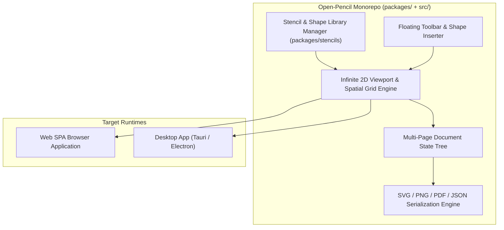

# Architectural Review: Open-Pencil

> **Target System**: Open-Pencil UI Wireframing & Diagramming Tool  
> **Source Location**: `/home/jonk/workspace/INSPIRE/LOWCODE/open-pencil`  
> **Review Context**: ESPEDAIR Designer (`designer`) Wireframing & Infinite Canvas Evaluation  
> **Date**: 2026-08-27  

---

## 1. Executive Summary

**Open-Pencil** is a modern, lightweight, open-source wireframing, UI prototyping, and diagramming tool built on a high-speed **Bun + Vite + TypeScript monorepo** architecture. It provides an infinite 2D canvas, extensive stencil libraries (desktop, mobile, web widgets), multi-page document modeling, and clean vector SVG export.

---

## 2. Core Architecture Breakdown

---

## 3. Key Architectural Strengths

### 3.1. Ultra-Fast Bun & Modern TypeScript Monorepo Toolchain
- **Instant Compilation & Bundling**: Uses Bun and Vite for near-instant cold boot and hot module replacement (HMR), with strict linting via `oxlint` and type checking.

### 3.2. Lightweight, Modular Stencil Architecture (`packages/stencils/`)
- **Declarative Shape Schemas**: Pre-packaged component stencils (buttons, form inputs, navigation bars, modal dialogs, flowchart connectors) are defined as modular JSON schemas with SVG rendering paths.
- **Custom Stencil Extension**: Developers can define custom domain-specific stencils (e.g. database table shapes, data pipeline connectors) with minimal code.

### 3.3. Infinite 2D Spatial Index & Zoomable Viewport
- **Spatial Culling**: Uses bounding-box spatial indexing to only render visible objects inside the active viewport, ensuring smooth 60fps panning and zooming on massive canvas workspaces.

---

## 4. Key Limitations & Design Trade-offs

1. **Static Wireframe Focus (No Live Data Execution)**:
   - Primarily designed for static UI wireframing and diagramming; lacks live database query execution, REST endpoints, or backend logic bindings.
2. **Local Storage / File-Centric Persistence**:
   - Stores documents primarily as local JSON/EP files without built-in multi-tenant PostgreSQL persistence or real-time collaborative servers.

---

## 5. Strategic Takeaways for ESPEDAIR Designer

| Capability | Open-Pencil Mechanism | ESPEDAIR Designer Opportunity |
| :--- | :--- | :--- |
| **Monorepo Tooling** | Bun + Vite + TypeScript monorepo | Use modern Vite + TypeScript for the Designer React 19 frontend package. |
| **Stencil Registry** | Modular JSON-based stencil packages | Structure Designer's widget toolbox with declarative component descriptors and icons. |
| **Spatial Canvas Math** | Infinite 2D zoom/pan with viewport culling | Adopt spatial culling math for large ER diagram models and Column Lineage DAG canvases. |
