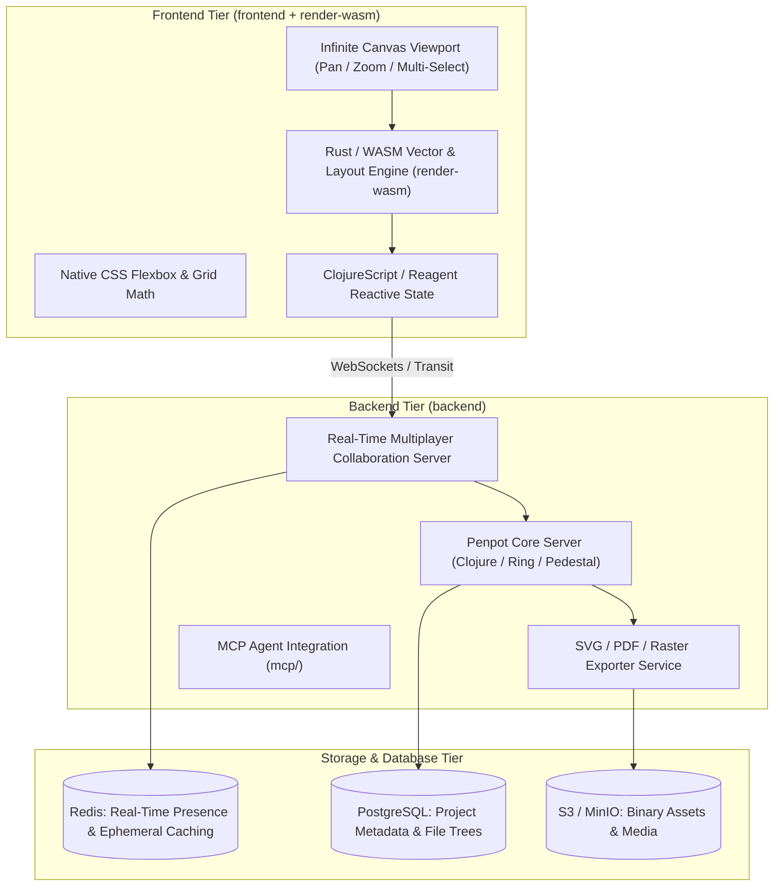

# Architectural Review: Penpot

> **Target System**: Penpot Open-Source Design & Prototyping Platform  
> **Source Location**: `/home/jonk/workspace/INSPIRE/LOWCODE/penpot`  
> **Review Context**: ESPEDAIR Designer (`designer`) Visual Canvas & Vector Engine Evaluation  
> **Date**: 2026-08-27  

---

## 1. Executive Summary

**Penpot** is the leading open-source, web-based vector design and prototyping platform (Figma alternative) built for design-to-code alignment. Its architecture leverages **SVG natively**, a **Clojure / ClojureScript** functional stack, and a high-performance **Rust / WebAssembly (WASM) vector rendering engine (`render-wasm`)** to deliver 60fps canvas interactions on complex multi-artboard canvases.

---

## 2. Core Architecture Breakdown

---

## 3. Key Architectural Strengths

### 3.1. WebAssembly-Accelerated Vector Canvas (`render-wasm`)
- **Rust/C++ Engine Compiled to WASM**: Offloads heavy path calculation, affine transforms, bounding box collision math, boolean path operations, and bezier curve tessellations directly to compiled WebAssembly, keeping the main browser UI thread responsive.

### 3.2. Native Standards-Based CSS Flexbox & CSS Grid Layouts
- **Design-to-Code Alignment**: Unlike proprietary vector coordinate systems, Penpot's layout engine maps directly to CSS Flexbox and CSS Grid properties (`justify-content`, `align-items`, `grid-template-columns`). When a developer inspects a component, the generated CSS matches real web layouts 1:1.

### 3.3. SVG-Native Object Model
- **Open Standards**: Every shape, path, container, and text layer is represented as standard SVG DOM objects and vector attributes, allowing lossless bidirectional export and rendering in any modern web browser.

### 3.4. Real-Time Multiplayer Collaboration & MCP Server (`mcp/`)
- **CRDT / Operational Transformation**: Live multi-cursor presence, concurrent editing, and instantaneous sync over WebSockets.
- **Model Context Protocol (MCP)**: Features an integrated MCP agent interface allowing AI coding agents to inspect component trees, read design tokens, and generate UI assets programmatically.

---

## 4. Key Limitations & Design Trade-offs

1. **Clojure / JVM Backend Dependency**:
   - Requires JVM hosting and Clojure runtime expertise, diverging from mainstream Go/Rust/TypeScript enterprise stacks.
2. **Heavy Initial Asset Bundle**:
   - ClojureScript runtime + WASM binary footprint requires asset pre-caching for optimal cold-start performance.

---

## 5. Strategic Takeaways for ESPEDAIR Designer

| Capability | Penpot Mechanism | ESPEDAIR Designer Opportunity |
| :--- | :--- | :--- |
| **Canvas Math & Rendering** | Rust `render-wasm` module | Adopt Rust compiled to WASM for high-performance canvas snapping and ER diagram layout. |
| **Layout Model** | Native CSS Flexbox & CSS Grid | Align low-code visual canvas containers directly with Tailwind CSS grid/flex models. |
| **AI Agent Integration** | Built-in MCP Server (`mcp/`) | Directly connect ESPEDAIR Designer to Antigravity / Enterprise Agent via MCP. |
| **Storage Architecture** | PostgreSQL exclusively for relational trees | Re-use existing ESPEDAIR PostgreSQL database for storing layout DSLs and component trees. |
