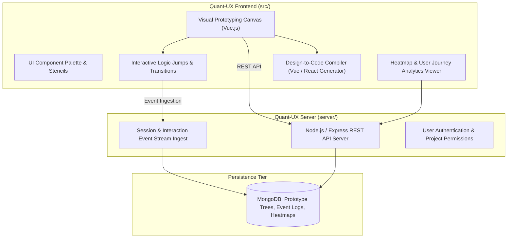

# Architectural Review: Quant-UX

> **Target System**: Quant-UX Visual Prototyping & UX Analytics Platform  
> **Source Location**: `/home/jonk/workspace/INSPIRE/LOWCODE/quant-ux`  
> **Review Context**: ESPEDAIR Designer (`designer`) Visual Prototyping & Analytics Evaluation  
> **Date**: 2026-08-27  

---

## 1. Executive Summary

**Quant-UX** is an integrated visual design, interactive prototyping, and quantitative usability testing platform. It combines a visual screen layout canvas (Vue.js) with interactive logic branching, user interaction recording, heatmaps, and an **automated design-to-code generation engine** that translates visual wireframes into executable Vue/React code components.

---

## 2. Core Architecture Breakdown

---

## 3. Key Architectural Strengths

### 3.1. Interactive Logic Branching & Screen Transitions
- **Stateful Wireframing**: Allows designers to link buttons and inputs to conditional logic rules (e.g. *If input is empty, show validation modal; else navigate to Dashboard screen*).
- **Zero-Code Prototyping**: Non-technical stakeholders can simulate end-to-end user journeys without writing frontend code.

### 3.2. Automated Design-to-Code Generation Engine (`src/core/generator/`)
- **Semantic Code Emission**: Analyzes visual canvas elements, container hierarchies, and style properties, and compiles them directly into clean, structured Vue.js and React component JSX trees.

### 3.3. Built-in Usability Analytics & Heatmaps
- **Interaction Heatmaps**: Automatically aggregates click, hover, and scroll telemetry from prototype sessions to visualize user focus and drop-off points.

---

## 4. Key Limitations & Design Trade-offs

1. **Legacy Vue.js Frontend Base**:
   - Built on earlier Vue/Webpack toolchains; lacks modern TypeScript strict typing and React 19 concurrent features.
2. **MongoDB-Centric Event Storage**:
   - Stores session events and prototype graphs as loose BSON documents without relational integrity constraints.

---

## 5. Strategic Takeaways for ESPEDAIR Designer

| Capability | Quant-UX Mechanism | ESPEDAIR Designer Opportunity |
| :--- | :--- | :--- |
| **Logic Transitions** | Screen-to-screen conditional jumps | Implement visual action flows connecting canvas buttons to REST APIs / queries. |
| **Code Generation** | Visual-to-Vue/React code generator | Integrate AST-to-Go and AST-to-React generator compiling visual apps into `enterprise-template`. |
| **UX Telemetry** | Session interaction recording | Provide built-in query execution metrics and user action telemetry in the Bottom Console. |
