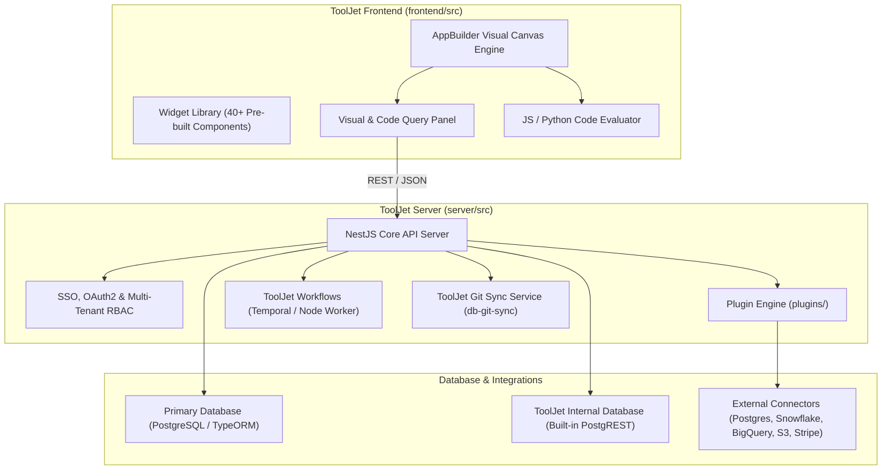

# Architectural Review: ToolJet

> **Target System**: ToolJet Open-Source Low-Code Framework  
> **Source Location**: `/home/jonk/workspace/INSPIRE/LOWCODE/ToolJet`  
> **Review Context**: ESPEDAIR Designer (`designer`) Architectural Evaluation  
> **Date**: 2026-08-27  

---

## 1. Executive Summary

**ToolJet** is a modern, developer-centric low-code framework for building internal business applications, data dashboards, and automated workflows. Its architecture is built entirely on a clean **TypeScript / Node.js stack (NestJS backend with TypeORM on PostgreSQL, and a React / Tailwind CSS frontend)**.

---

## 2. Core Architecture Breakdown

---

## 3. Key Architectural Strengths

### 3.1. Pure TypeScript / NestJS / PostgreSQL Monorepo Architecture
- **Unified Language Stack**: Frontend and backend share TypeScript types, validation schemas, and common utilities.
- **Relational First (PostgreSQL Exclusively)**: Unlike MongoDB-centric platforms, all metadata, revisions, granular role-based permissions, and user audit logs are stored in PostgreSQL using clean TypeORM entities.

### 3.2. Extensible Marketplace & Plugin SDK (`plugins/`)
- **Decoupled Connector Packages**: Each data source (PostgreSQL, Snowflake, BigQuery, ClickHouse, Google Sheets, Airtable) is an isolated npm package under `plugins/packages/` conforming to standard interfaces (`Connection`, `QueryRunner`).
- **Secure Credential Vault**: Encryption at rest for data source credentials using AES-256-GCM.

### 3.3. Built-in Relational "ToolJet DB" & Visual Query Builder
- **PostgREST-Powered Fast Storage**: Includes an embedded data table engine allowing users to create relational tables, foreign keys, and indexes directly from the visual UI without external DB setup.
- **Visual Transformations**: Supports JS/Python transformations and query chaining directly inside the Query Manager panel.

### 3.4. Granular RBAC & Git Synchronization (`db-git-sync`)
- **Version Control**: Supports connecting repositories to Git for version tracking, branching, and automated deployment promotion across environments (`Development`, `Staging`, `Production`).

---

## 4. Key Limitations & Design Trade-offs

1. **Client-Side Heavy Canvas Re-Renders**:
   - Complex canvases with deeply nested container widgets can experience rendering bottlenecks during large dataset updates in React.
2. **Monolithic Backend Scaling**:
   - NestJS monolith handles app execution, auth, query execution, and workflows in the same process cluster, requiring separation of worker nodes under high analytical load.

---

## 5. Strategic Takeaways for ESPEDAIR Designer

| Capability | ToolJet Mechanism | ESPEDAIR Designer Opportunity |
| :--- | :--- | :--- |
| **Tech Stack** | NestJS + TypeORM + PostgreSQL | Aligns with ESPEDAIR's strict **PostgreSQL-first** architecture and Rust core. |
| **Plugin Isolation** | Standardized npm plugin packages | Adopt standardized Rust traits (`DatabaseDriver`, `DataConnectorPort`). |
| **Embedded DB** | ToolJet DB (PostgREST) | Integrate Schematics in-process sandbox & DuckDB/PostgreSQL local instance. |
| **Canvas UX** | React drag-and-drop grid | Build high-performance React 19 / Canvas layout with sub-millisecond snapping. |
